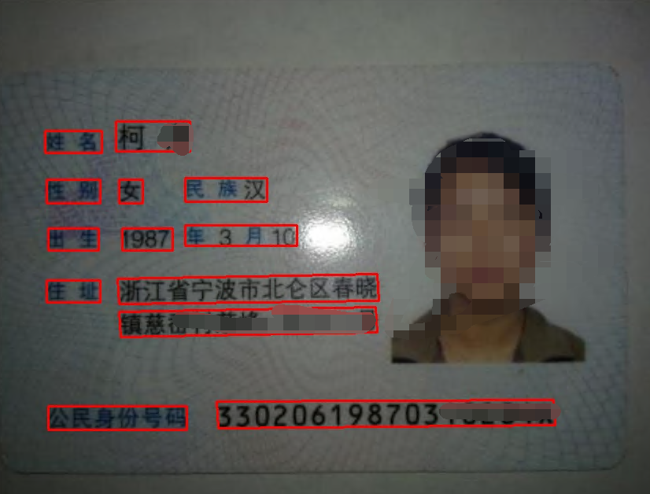
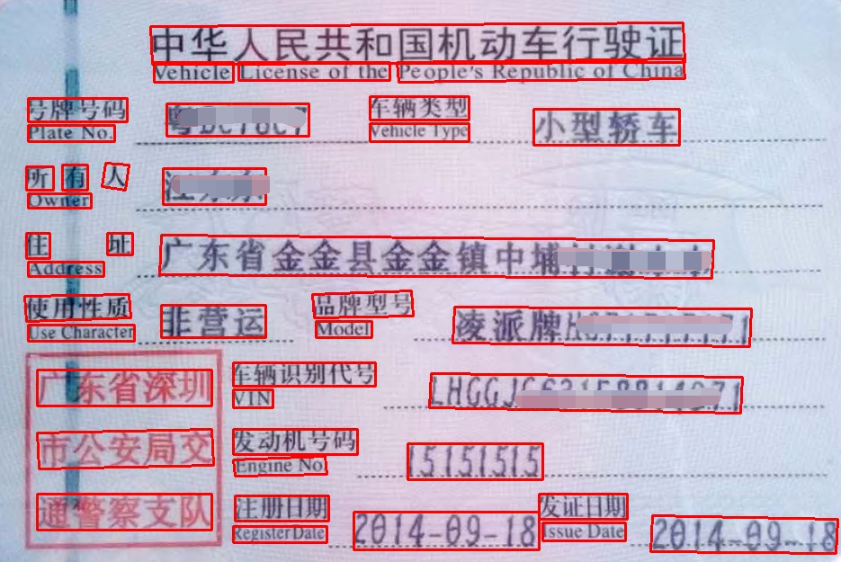

## keras implementation of PSENET 
For more detials , please see the the original paper : [Shape Robust Text Detection with Progressive Scale Expansion Network](https://arxiv.org/abs/1806.02559)

百度网盘:链接：https://pan.baidu.com/s/1U1dYc4sYxKtoqSGMgP_n4A 提取码：40dh 

### Results:

     
     
     

### PSENET for ICPR MTWI 2018 Challenge 2 Text detection.
| Method | Precision (%) | Recall (%) | F-measure (%) | 
| - | - | - | - |
| PSENet-2s-resnet50 | 72.2 | 68.7 | 0.704 |

